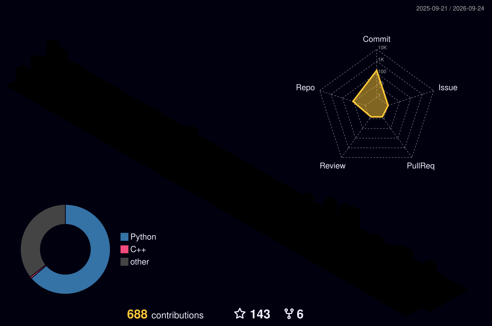

<pre>
███╗   ██╗ █████╗ ████████╗██╗  ██╗ █████╗ ███╗   ██╗██╗███████╗██╗
████╗  ██║██╔══██╗╚══██╔══╝██║  ██║██╔══██╗████╗  ██║██║██╔════╝██║
██╔██╗ ██║███████║   ██║   ███████║███████║██╔██╗ ██║██║█████╗  ██║
██║╚██╗██║██╔══██║   ██║   ██╔══██║██╔══██║██║╚██╗██║██║██╔══╝  ██║
██║ ╚████║██║  ██║   ██║   ██║  ██║██║  ██║██║ ╚████║██║██║     ██║
╚═╝  ╚═══╝╚═╝  ╚═╝   ╚═╝   ╚═╝  ╚═╝╚═╝  ╚═╝╚═╝  ╚═══╝╚═╝╚═╝     ╚═╝

        UAV AUTONOMOUS NAVIGATION · VISION-LANGUAGE-REASONING
        REINFORCEMENT LEARNING · MULTIMODAL ROBOTICS
</pre>

  
  

  

 

  

<i>Researching reliable autonomy at the intersection of vision, language and control.</i>

## Engineering stack

  

## GitHub telemetry

  

## Contribution map

  <picture>
    <source media="(prefers-color-scheme: dark)" srcset="https://raw.githubusercontent.com/Nathanielneil/Nathanielneil/output/github-snake-dark.svg" />
    <source media="(prefers-color-scheme: light)" srcset="https://raw.githubusercontent.com/Nathanielneil/Nathanielneil/output/github-snake.svg" />
    
  </picture>

<i>Generated daily by GitHub Actions.</i>

  <picture>
    <source media="(prefers-color-scheme: dark)" srcset="./profile-3d-contrib/profile-night-rainbow.svg" />
    <source media="(prefers-color-scheme: light)" srcset="./profile-3d-contrib/profile-green.svg" />
    
  </picture>

 

  <code>[ currently building ]</code> &nbsp; embodied intelligence for the physical world

  

